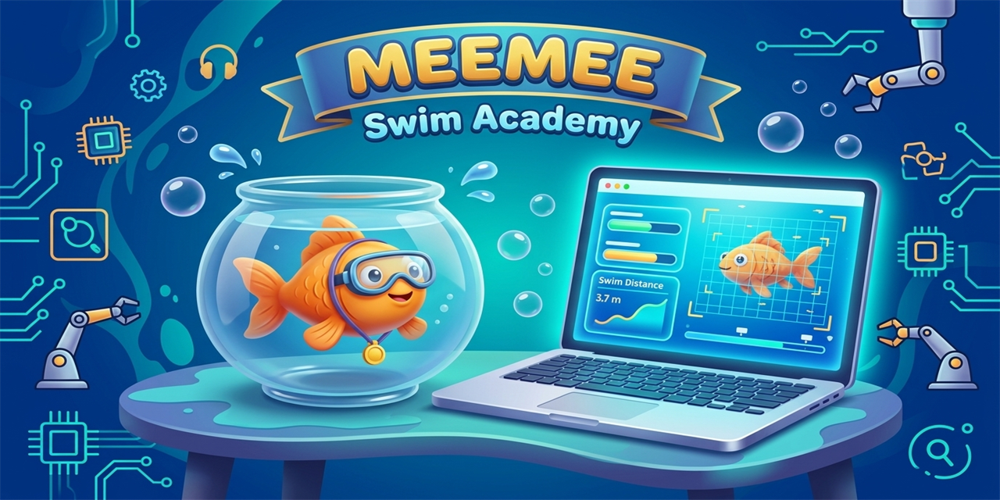
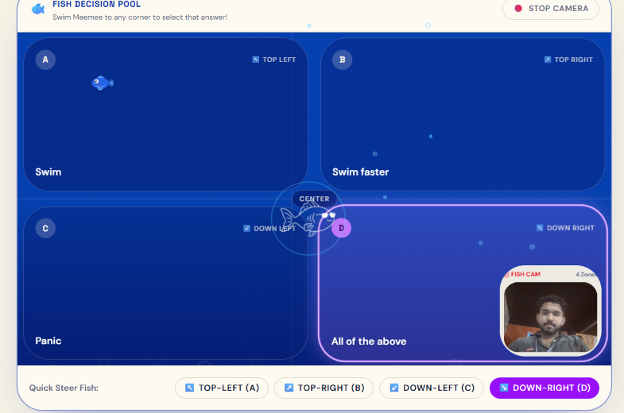
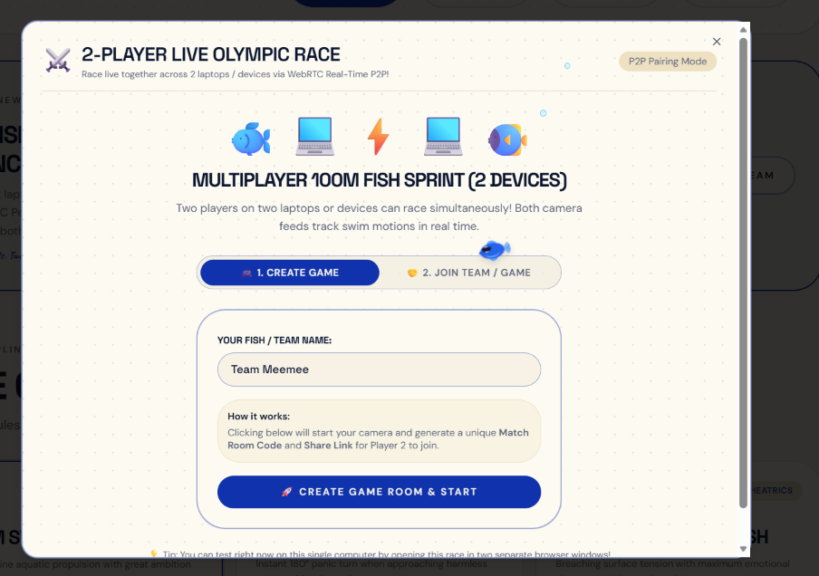
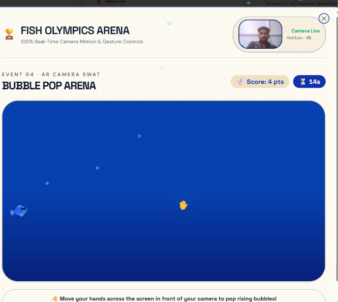
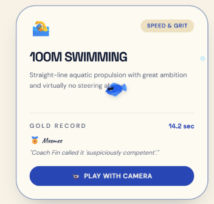
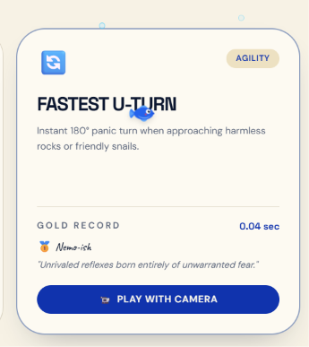
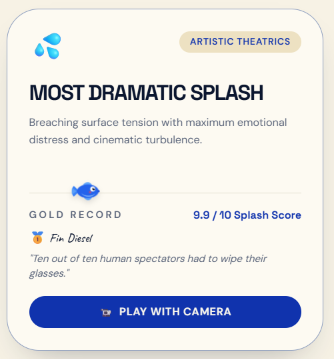
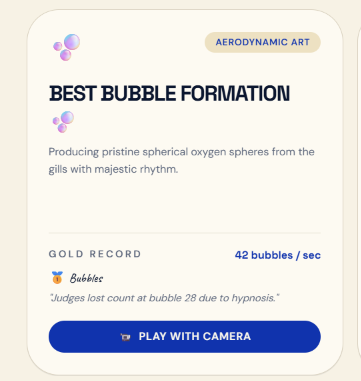
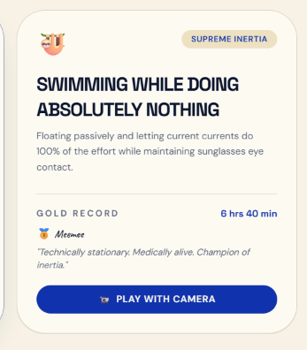
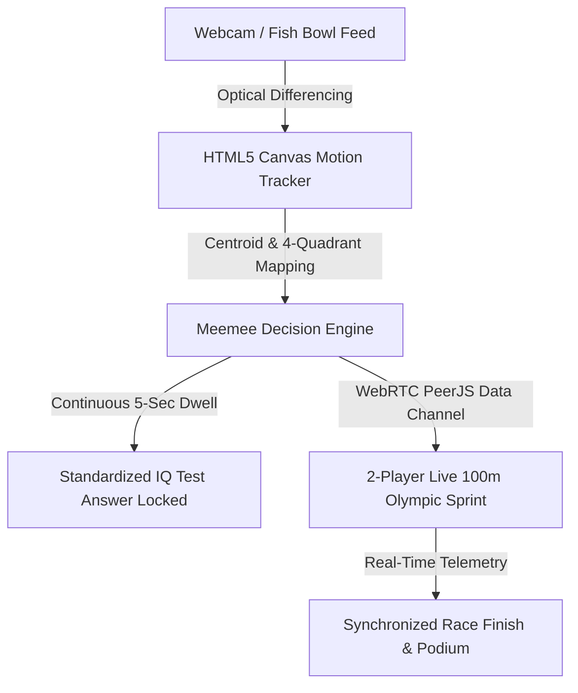

# MEEMEE Swim Academy 🐟 🎯

## Basic Details
### Team Name: pazhampori

### Team Members
- Team Lead: Alwin Jose George - St. Joseph's College of Engineering and Technology, Palai (SJCET Palai)
- Member 2: Febin Noble - St. Joseph's College of Engineering and Technology, Palai (SJCET Palai)

### Project Description
An elite, playful aquatic web academy where actual fish (or humans waving hands) use webcam computer vision to navigate 4 interactive training courses, take standardized aquatic IQ tests with a 5-second dwell hold, and compete in real-time 2-player peer-to-peer Olympic sprints.

### The Problem (that doesn't exist)
Fish were born in water and have been swimming naturally for over 500 million years without human oversight. Yet, nobody has ever standardized their aquatic credentials, assessed their existential swimming IQ, or forced them to race against other laptops over WebRTC to prove their athletic superiority.

### The Solution (that nobody asked for)
We built MEEMEE Swim Academy — complete with:
- An interactive **4-Quadrant Fish Motion Decision Pool** (`/iq-test`) with live optical differencing and a strict **5-second dwell hold rule** to verify answers.
- A **2-Player Live Olympic Race** (`/olympics`) using **WebRTC P2P** to let two laptops race their fish simultaneously with real-time motion telemetry.
- A **4-level interactive training pool curriculum** (`/train`) with dodging, speed currents, and electric jellyfish.
- Official certificate generation signed reluctantly by Coach Fin.

## Technical Details
### Technologies/Components Used
For Software:
- **Languages**: TypeScript, HTML5, CSS3, SQL
- **Frameworks**: React 19, TanStack Start, TanStack Router, Tailwind CSS v4, Vite, Nitro
- **Database / Backend**: Neon Serverless PostgreSQL (`@neondatabase/serverless`)
- **Libraries**: PeerJS (WebRTC), Radix UI, Lucide React
- **Tools & APIs**: HTML5 Canvas Optical Differencing, Web Audio API, MediaDevices API

For Hardware:
- Webcam (built-in laptop camera or external USB camera to track real fish bowl or hand motion)

### Implementation
For Software:
# Installation
```bash
# Clone the repository
git clone https://github.com/alwinjosegeorge/useless_project_temp.git
cd useless_project_temp

# Install dependencies
npm install
```

# Run
```bash
# Start local development server
npm run dev
# App opens at http://localhost:8080
```

### Project Documentation
For Software:

# Screenshots (Add at least 3)

*Fish IQ Test: Meemee swims across 4 quadrants (↖️ A, ↗️ B, ↙️ C, ↘️ D) with optical webcam tracking and a 5-second dwell hold countdown.*


*Multiplayer 100m Fish Sprint: 2 laptops connect via WebRTC peer-to-peer room codes to race their fish simultaneously.*


*Interactive Training Pool: 4 fully playable levels including dodging obstacles, catching speed currents, and avoiding jellyfish.*


*Event 04 Bubble Pop Arena: Custom swimming fish cursor popping bubbles under Coach Fin's watchful eye.*


*Olympic Event: Fastest U-Turn (Agility) — Instant 180° panic turn when approaching harmless rocks or friendly snails with live optical motion tracking.*


*Olympic Event: Most Dramatic Splash (Artistic Theatrics) — Breaching surface tension with maximum emotional distress and cinematic turbulence.*


*Olympic Event: Best Bubble Formation (Aerodynamic Art) — Producing pristine spherical oxygen bubbles from the gills with majestic rhythm.*


*Olympic Event: Swimming While Doing Absolutely Nothing (Supreme Inertia) — Floating passively while letting current currents do 100% of the effort.*

# Diagrams

*System Architecture: Real-time computer vision processing through Canvas without backend AI latency, combined with WebRTC P2P multiplayer sync.*

### Project Demo
# Video
[Add your demo video link here]
*Demonstrating 4-quadrant fish motion tracking, 5-second dwell hold countdown, and 2-player multiplayer race.*

# Additional Demos
- Live Web Deployment (Vercel): https://meeemee.vercel.app/
- Interactive IQ Test: `/iq-test`
- 2-Player Olympic Race: `/olympics`
- 4-Level Training: `/train`

## Team Contributions
- Alwin Jose George: Full-stack architecture, 4-quadrant fish motion tracking, 5-second dwell confirmation engine, WebRTC 2-player Olympic race, and responsive UI design.
- Febin Noble: Neon Serverless PostgreSQL backend integration, database schema design, and gameplay testing.

---
Made with ❤️ at TinkerHub Useless Projects 


